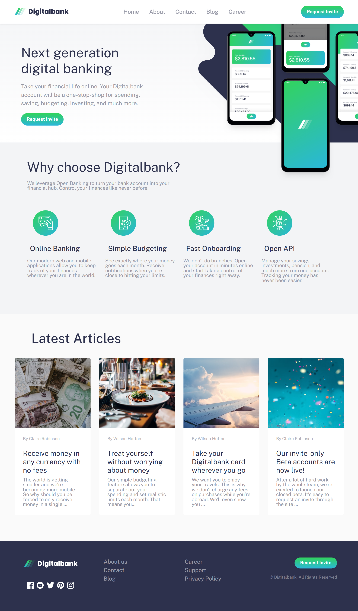
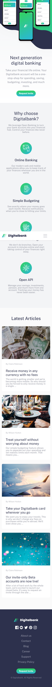

# Frontend Mentor - Digitalbank landing page solution

This is a solution to the [Digitalbank landing page challenge on Frontend Mentor](https://www.frontendmentor.io/challenges/digital-bank-landing-page-WaUhkoDN). Frontend Mentor challenges help you improve your coding skills by building realistic projects.

## Table of contents

- [Overview](#overview)
  - [Screenshot](#screenshot)
  - [Links](#links)
- [My process](#my-process)
  - [Built with](#built-with)
  - [Useful resources](#useful-resources)
- [Author](#author)

## Overview

### Screenshot

### Links

- Solution URL: [Solution URL here](https://github.com/lianxxxx/frontend-mentor-bootstrap-landing-page)
- Live Site URL: [Live site URL via Netlify](https://frontend-mentor-digital-bank.netlify.app/)

## My process

### Built with

- Semantic HTML5 markup
- CSS custom properties
- Flexbox
- CSS Grid
- Mobile-first workflow
- Bootstrap

### Useful resources

- [Bootstrap](https://getbootstrap.com/) - This helped me for easier development because of its clear documentation and ready-to-use components.

- [Google Fonts](https://fonts.google.com/) - The project employs Public Sans from Google Fonts, offering a well-documented and readily accessible font resource that streamlined the development process.

## Author

- GitHub - [Leyanne](https://github.com/lianxxxx)
- Frontend Mentor - [@lianxx](https://www.frontendmentor.io/profile/lianxxxx)

